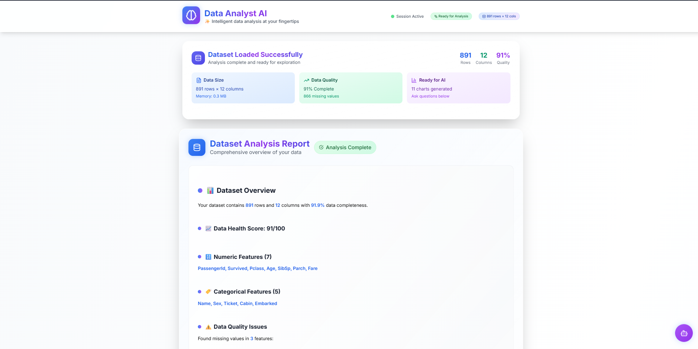

echo "# 🤖 Data Analyst AI Agent

An intelligent AI-powered data analysis platform that transforms complex data analysis into simple, conversational interactions.

## 🌟 Features

- **Natural Language Queries**: Ask questions in plain English
- **Auto-Generated Visualizations**: 12+ chart types with statistical analysis
- **AI-Powered Insights**: Comprehensive trend analysis and business recommendations
- **Interactive Dashboard**: Premium UI with real-time processing
- **Smart Data Assessment**: Automatic quality scoring and cleaning suggestions
- **Multi-Format Support**: CSV, Excel files with robust error handling

## 🚀 Quick Start

### Prerequisites
- Python 3.9+
- Node.js 18+
- Git

### Backend Setup

\`\`\`bash
# Clone the repository
git clone https://github.com/SamarthAlpha/data-analyst-ai-agent.git
cd data-analyst-ai-agent

# Setup Python virtual environment
python -m venv venv
source venv/bin/activate  # On Windows: venv\Scripts\activate

# Install backend dependencies
cd backend
pip install -r requirements.txt

# Create environment file
echo \"GEMINI_API_KEY=your_api_key_here\" > .env

# Start backend server
uvicorn main:app --reload --host 0.0.0.0 --port 8000
\`\`\`

### Frontend Setup

\`\`\`bash
# In a new terminal, navigate to frontend
cd frontend

# Install dependencies
npm install

# Create environment file
echo \"NEXT_PUBLIC_API_URL=http://localhost:8000\" > .env.local

# Start frontend development server
npm run dev
\`\`\`

Visit http://localhost:3000 to use the application!

## 🛠️ Tech Stack

### Backend
- **FastAPI**: High-performance web framework
- **Pandas**: Data manipulation and analysis
- **Plotly**: Interactive visualizations
- **Google Gemini AI**: Natural language processing
- **Python**: Core programming language

### Frontend
- **Next.js**: React framework
- **React**: UI library
- **Tailwind CSS**: Utility-first CSS framework
- **Lucide Icons**: Beautiful icons

## 📊 How It Works

1. **Upload**: Drag and drop CSV/Excel files
2. **Analyze**: AI performs comprehensive data assessment
3. **Visualize**: Auto-generates premium charts with insights
4. **Interact**: Chat with AI about your data
5. **Export**: Download reports and visualizations

## 🎯 AI Agent Capabilities

This project demonstrates core AI agent characteristics:

- ✅ **Autonomous Decision Making**: Automatically chooses analysis methods
- ✅ **Multi-Modal Processing**: Handles data, text, and visualizations
- ✅ **Context Awareness**: Remembers conversation history
- ✅ **Tool Usage**: Leverages multiple libraries intelligently

## 📸 Screenshots

### 🏠 Main Dashboard

### 📊 Data Analysis Interface

### 💬 AI Chat Interface

### 🎯 Insights Panel

## 🤝 Contributing

1. Fork the repository
2. Create a feature branch (\`git checkout -b feature/AmazingFeature\`)
3. Commit your changes (\`git commit -m 'Add some AmazingFeature'\`)
4. Push to the branch (\`git push origin feature/AmazingFeature\`)
5. Open a Pull Request

## 🙏 Acknowledgments

- **BlockSeBlock** and **OpenXAI** for the internship opportunity
- Google Gemini AI for natural language processing
- The open-source community for amazing tools and libraries

---

Built with ❤️ by Samarthsingh Rajput as part of OpenXAI internship at BlockSeBlock" > README.md
